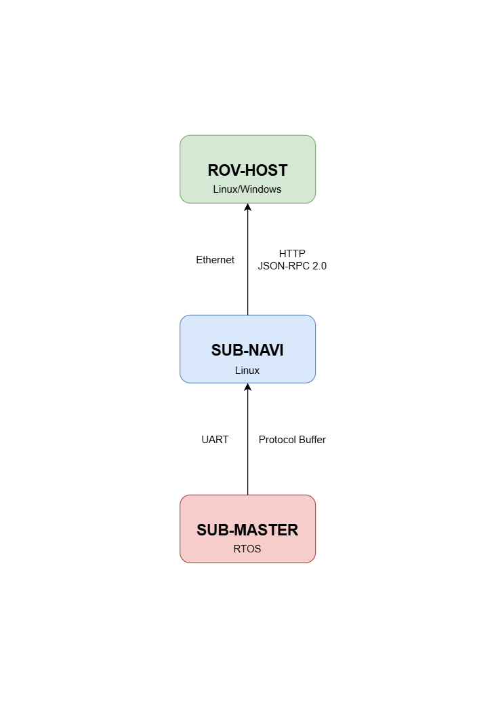

<div align="center">
  <a href="https://github.com/sfxfs/sub-navi"><h1>SUB-NAVI</h2></a>
</div>
[](https://deepwiki.com/sfxfs/sub-navi)

[ [中文](README.md) | English ]

## Introduction

This project (SUB-NAVI) is a general-purpose underwater robot control program based on the Linux platform. It is designed to work together with [ESP-SUB-MASTER](https://github.com/sfxfs/esp-sub-master) and [ROV-HOST](https://github.com/bohonghuang/rov-host). The software has been tested on the hardware platform [Underwater-Vehicle-Electrical-Control-System](https://github.com/SFerret/Underwater-Vehicle-Electrical-Control-System).

The system architecture connection diagram is shown below:



The SUB-NAVI project provides the following features:

- Communication with the PC-based upper-level host (ROV-HOST) using the JSON-RPC 2.0 protocol over HTTP (IO event listening is used to enhance performance).
- Serial communication with SUB-MASTER using Protocol Buffers (for controlling peripherals, thrusters, robotic arms, etc.).
- Support for external sensors and other peripherals via serial communication.
- Configuration management based on the filesystem (CSV, JSON).
- Motion control algorithms.

## Compilation

This project is tested on the `Rockchip rv1103` platform, with an `armhf` architecture. It should be compiled using the `arm-rockchip830-linux-uclibcgnueabihf` compiler.

To compile, use a Linux environment and ensure the following are installed:

- Cross-compilation toolchain (ensure it is added to PATH).
- `cmake`.

Navigate to the project root directory and run the following command to compile:

```shell
cmake -B build -DCMAKE_BUILD_TYPE=Release -DCMAKE_C_COMPILER=arm-rockchip830-linux-uclibcgnueabihf-gcc -DCMAKE_CXX_COMPILER=arm-rockchip830-linux-uclibcgnueabihf-g++ && cmake --build build --config Release
```

If using VSCode for compilation, also ensure the following are installed:

- CMake project build-related extensions.
- `ninja-build`.

Open the project with VSCode. When prompted, select the appropriate toolchain in the configuration dialog. Then, use the bottom toolbar to build the project.

## Development

The project is organized into three main directories at the root level:

- **`3rd`**: Contains third-party libraries and general-purpose code.
- **`config-header`**: Contains global configuration header files.
- **`user`**: Contains the user project source code.

The `user` folder includes several key functional modules:

- **`control`**: Contains the robot control algorithms.
- **`csv-json-config-sys`**: Contains the program's configuration management system code.
- **`json-rpc-server`**: Contains the JSON-RPC server application code.
- **`peripheral`**: Contains the drivers for peripherals.
- **`protobuf-commu`**: Contains the code for communication with SUB-MASTER.